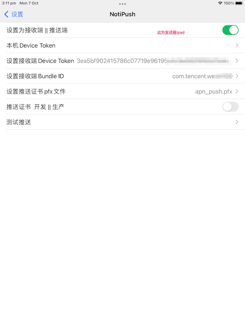

# Noti-Push
完美解决微信双开APN推送插件

需要一台 iPad 作为消息发送端，类似于 PKC 插件中的 Bark 推送功能。不同之处在于，该插件直接调用苹果的 APNs 服务，因此接收端需要使用带有推送权限的自签名证书。


## 发送端


- 发送端需要准备pfx证书，下载苹果的apn推送证书.cer, 以下命令转换
```bash
#convert p12 to pem 
openssl pkcs12 -in aps_push.p12 -out apns-cert.pem -nodes -clcerts
```

```bash
#convert to pfx
openssl pkcs12 -export -out aps_push.pfx -in apns-cert.pem    
```
- 不要设置密码，转换完成后通过icloud传到ipad
- 发送端需要配合锤子助手/微信助手的永驻后台使用，杀后台后不推送


------

## 接收端


- 接收端需要打开苹果推送权限，device token自动获取，复制到推送端的‘接收端Device Token"
- 接收端的Bundle ID 必须设置到发送端
- 接收端在微信设置-消息通知那关闭系统消息通知，要不会重复推送。